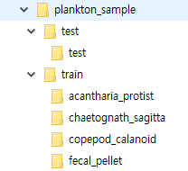

# [튜토리얼] 합성곱신경망(Convolutional Neural Network)을 이용한 플랑크톤 이미지 분류

## 1. 튜토리얼 개요
  - 본 튜토리얼은 이미지 분류에 뛰어난 성능을 보이는 합성곱신경망을 이용하여, 수중에 사는 플랑크톤의 이미지를 분류하는 기능을 파이썬으로 구현하는 튜토리얼입니다.  

## 2. 활용 데이터
  - 본 튜토리얼은 4종의 플랑크톤 데이터를 활용하였습니다. 해당 데이터는 Kaggle의 [Plankton Challenge](https://www.kaggle.com/c/plankton-challenge/data)에서 다운로드하였으며,  
  - 데이터 저작권 등의 이유로 데이터를 직접 업로드하지는 않았습니다. 
  - 폴더 구조는 아래와 같습니다.
  
  
## 2. CNN(Convolutional Neural Network)
  - CNN은 Convolutional Neural Networks의 약자로 딥러닝에서 주로 이미지나 영상 데이터를 처리에 사용됨

## 3. Tutoral 주요 내용
  - CNN 모형 훈련 및 예측
