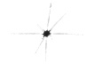
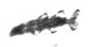
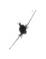
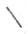

# [튜토리얼] 합성곱신경망(Convolutional Neural Network)을 이용한 플랑크톤 이미지 분류

## 1. 튜토리얼 개요
  - 본 튜토리얼은 이미지 분류에 뛰어난 성능을 보이는 합성곱신경망을 이용하여, **수중에 사는 플랑크톤의 이미지를 분류하는 기능**을 파이썬으로 구현하는 튜토리얼입니다.  

## 2. 활용 데이터
  - 본 튜토리얼을 위해 사용된 데이터는 Kaggle의 [Plankton Challenge](https://www.kaggle.com/c/plankton-challenge/data) 다운로드 가능합니다.
  - 실제 데이터에는 121종의 플랑크톤이 있지만, 본 튜토리얼에서는 4종만을 이용하였습니다. 사용한 폴더 구조는 아래와 같습니다.

  - train 폴더에는 훈련을 위한 총 4종의 플랑크톤 이미지가 포함되어 있습니다.

|acantharia_protist|chaetognath_sagitta|copepod_calanoid|fecal_pellet|
|:---:|:---:|:---:|:---:|
|||||
    
  - test 폴더에는 학습된 모형의 성능평가를 위한 플랑크콘 이미지가 포함되어 있습니다. 
  
## 2. CNN(Convolutional Neural Network)
  - CNN은 Convolutional Neural Networks의 약자로 딥러닝에서 주로 이미지나 영상 데이터 처리에 사용되며, 이미지 분류에서 우수한 성능을 보입니다.

## 3. Tutoral 주요 내용
  - 합성곱신경망 모형 훈련 및 예측
